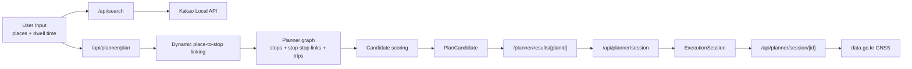

# Jeju Bus Guide Tour Plan

제주 버스 기반 관광 일정 플래너입니다.  
사용자가 장소 순서와 체류 시간을 정하면, 실데이터로 적재된 제주 버스 노선/시간표/보행 링크를 바탕으로 후보 일정을 계산하고, 선택한 후보를 실행 세션으로 추적할 수 있습니다.

이 저장소는 샘플 데이터가 아니라 실제 ingest 파이프라인을 전제로 동작하도록 구성되어 있습니다.

## 핵심 요약

- Next.js App Router + Prisma + SQLite 기반 웹 앱입니다.
- 장소 검색은 `Kakao Local API`를 사용합니다.
- 버스 데이터는 `bus.jeju.go.kr` 기반 정류소, 노선 HTML, 시간표 데이터를 worker가 적재합니다.
- 보행 링크는 OSRM을 이용해 계산하며, OSRM이 내려가 있으면 상세 원인과 함께 오류로 처리합니다.
- 실시간 세션은 `data.go.kr` GNSS API를 사용할 수 있고, 현재 구현에서는 현재 ride leg 중심으로 지연을 반영합니다. 키가 없거나 매핑이 없으면 시간표 기준 fallback 으로 계속 동작합니다.
- `/admin` 화면에서 ingest 실행과 적재 상태 검증이 가능합니다.

## 현재 구현 범위

- 장소 검색
  - `KAKAO_REST_API_KEY` 기반 카카오 장소 검색
- 버스 플래너
  - `FASTEST`
  - `LEAST_WALK`
  - `LEAST_TRANSFER`
- 실행 세션
  - 현재 leg
  - 다음 leg
  - 30초 polling
  - 현재 ride leg 기준 GNSS 지연 반영 및 시간표 안내
- 관리자 화면
  - source catalog
  - ingest jobs / run history
  - POI 연결 예외(사전 계산 walk-link 기준)
  - route pattern 검토
  - timetable / vehicle map 검토
- 실데이터 ingest worker
  - `stops`
  - `stop-translations`
  - `visit-jeju-places`
  - `routes-html`
  - `timetables-xlsx`
  - `vehicle-device-map`
  - `walk-links`

## 기술 스택

- Runtime: Node.js 22
- Web: Next.js 16, React 19
- DB: Prisma + SQLite
- Validation: Zod
- Parsing: Cheerio, XLSX, csv-parse, fast-xml-parser
- Testing: Vitest
- Routing support: OSRM

## 화면 구성

- `/`
  - `/planner`로 redirect
- `/planner`
  - 장소 검색, 방문 순서, 체류시간 입력
- `/planner/results/[planId]`
  - 후보 3종과 경고 확인
- `/planner/execute/[sessionId]`
  - 실행 세션 타임라인, 현재/다음 leg, 실시간 적용 여부
- `/admin`
  - 내부 운영용 ingest / 검증 화면
  - `ENABLE_INTERNAL_ADMIN=true`일 때만 노출

## 공개 API

- `GET /api/search?kind=place|stop&q=&limit=`
- `POST /api/planner/plan`
- `POST /api/planner/session`
- `GET /api/planner/session/[id]`
- `POST /api/admin/ingest/run`
  - 내부 관리자 전용

## 아키텍처 개요



## 데이터 흐름

### 1. 장소 검색

- `GET /api/search`의 `kind=place`는 Kakao Local keyword search로 동작합니다.
- 현재 구현에서는 `GET /api/search`와 `POST /api/planner/plan` 모두 planner catalog readiness를 공통으로 검사합니다.
- `KAKAO_REST_API_KEY`가 필요합니다.
- 저장된 장소(`mode: "stored"`)와 외부 장소(`mode: "external"`)를 모두 플래너 입력으로 받을 수 있습니다.

### 2. 플래너 입력 처리

- `POST /api/planner/plan`은 최대 5개 장소를 받습니다.
- 장소별 체류 시간은 10분~240분입니다.
- 중복 장소는 저장형/외부형 모두 dedupe 합니다.
- 저장된 장소는 `Place`를 참조하고, 외부 검색 결과는 위경도 snapshot을 `PlanQueryPlace`에 함께 저장합니다.

### 3. 장소 -> 정류소 연결

- 사용자가 고른 장소마다 요청 시점에 동적으로 근처 정류소를 다시 계산합니다.
- 후보 정류소 계산 규칙
  - 반경 우선: 1.8km 이내 정류소 우선
  - 사전 후보: 최대 12개
  - 최종 선택: 보행 시간 기준 상위 5개
- 측정 방식
  - OSRM 도보 경로만 사용
  - OSRM 오류 시 plan API가 503과 상세 원인을 반환

주의:

- `walk-links` job은 `STOP_STOP` 전이 링크와 사전 계산용 링크를 적재합니다.
- 실제 플래너는 사용자가 고른 장소에 대해서는 요청 시 동적으로 place-stop / stop-place 링크를 다시 계산합니다.

### 4. 버스 그래프

플래너가 읽는 핵심 그래프는 아래 테이블로 구성됩니다.

- `Stop`
- `WalkLink` 중 `STOP_STOP`
- `RoutePattern`
- `Trip`
- `StopTime`
- `VehicleDeviceMap`

### 5. 후보 생성

플래너 엔진은 DFS 기반으로 일정 후보를 만들고, 점수 함수를 통해 3종 후보를 선택합니다.

현재 엔진의 중요한 제약은 아래와 같습니다.

- 장소별 접근 정류소 사용 수: 최대 5개
- 장소-정류소 도보 허용치: 최대 25분
- 세그먼트 탐색 창: 거리 기반 90~210분
- 첫 탑승 buffer: 5분
- 환승 buffer: 4분
- 보간 stop time safety cost: 6분
- 브랜치 상한: 40개

이 값들은 장거리 제주 이동에서 “버스가 있는데도 후보 없음”이 뜨지 않도록 조정되어 있습니다.

### 6. 경고 생성

후보마다 아래 경고가 붙을 수 있습니다.

- `OPENING_HOURS_CONFLICT`
  - 저장형 장소의 운영시간과 체류 구간이 충돌
- `ESTIMATED_STOP_TIMES`
  - 일부 stop time이 보간값
- `REALTIME_UNAVAILABLE`
  - 후보 전체에 실시간 적용 가능한 route pattern이 없음
- `TRANSFER_REQUIRED`
  - 환승 포함

### 7. 실행 세션

- `POST /api/planner/session`으로 후보를 세션으로 바꿉니다.
- `/planner/execute/[sessionId]`는 30초마다 polling 합니다.
- 실시간 반영 규칙
  - `VehicleDeviceMap`이 있고
  - `DATA_GO_KR_SERVICE_KEY`가 있고
  - 현재 또는 다음 leg가 `ride`일 때
  - `data.go.kr` GNSS를 호출해 지연분을 계산
- 현재 구현에서는 현재 leg가 `ride`인 경우에만 지연분이 세션 상태에 직접 반영됩니다.
- 실패 시에도 세션 API는 200 응답을 유지하고 시간표 기준 fallback 으로 안내합니다.

## 데이터 소스

### 장소

- 현재 플래너 장소 검색은 `Kakao Local API`를 사용합니다.
- `VISIT_JEJU_BASE_URL`은 `visit-jeju-places` worker용 override 입니다.

### 정류소

- 기본 적재원: `bus.jeju.go.kr /data/search/stationListByBounds`
- 환경 override: `BUS_STOPS_SOURCE_URL`

### 정류소 번역

- 기본 적재원: bus.jeju station multilingual fields
- 환경 override: `STOP_TRANSLATIONS_XLSX_PATH`
  - `.xlsx`
  - `.xls`
  - `.json`

### 노선 메타

- 적재원: `bus.jeju.go.kr/mobile/schedule/listSchedule`
- 상세: `detailSchedule?scheduleId=...`

### 시간표

- 기본 적재원: `bus.jeju.go.kr/data/schedule/getScheduleTableInfo`
- 환경 override: `ROUTE_TIMETABLE_BASE_URL`
  - `.xlsx`
  - `.xls`

### 실시간 디바이스 매핑

- 적재원: 별도 공식 source 파일
- 환경 필수: `VEHICLE_MAP_SOURCE_URL`

### 실시간 GNSS

- 적재원: `data.go.kr` 제주 버스 GNSS API
- 환경 필수: `DATA_GO_KR_SERVICE_KEY`

## Worker Job 설명

### `stops`

- 실정류소 master 적재
- `Stop` upsert
- 기본적으로 제주 전역 bounds 조회를 사용

### `stop-translations`

- 정류소 다국어명 적재
- bus.jeju 다국어 필드 또는 외부 XLSX/JSON 사용

### `visit-jeju-places`

- 현재 플래너 장소 검색에는 사용하지 않습니다.
- VISIT JEJU 관광지/음식점/숙소 적재
- 운영시간 raw/json 파싱
- `Place`, `PlaceLocale`, 세부 detail 테이블 upsert

### `routes-html`

- `bus.jeju.go.kr` 모바일 HTML에서 schedule id, 노선 번호, 방향, 메타데이터 적재
- `Route`, `RoutePattern` upsert

### `timetables-xlsx`

- 가장 오래 걸리는 job입니다.
- route pattern마다 시간표를 수집하고 `Trip`, `StopTime`, `RoutePatternStop`을 만듭니다.
- stop name matching을 위해
  - 정규화 키
  - bus.jeju line info
  - 번역명
  - 축약 alias
  - fallback known stop scoring
  를 함께 사용합니다.
- 기존 샘플/legacy transit data는 이 job 시작 시 정리합니다.

### `vehicle-device-map`

- route pattern과 GNSS device id를 연결
- 이 job이 없으면 실행 세션은 실시간 대신 시간표 fallback 으로 동작합니다.

### `walk-links`

- OSRM 기반 보행 링크 적재
- `PLACE_STOP`, `STOP_PLACE`, `STOP_STOP`을 생성
- 플래너 readiness에는 특히 `STOP_STOP`이 중요합니다.

## 프로젝트 구조

```text
app/                      Next.js App Router pages and API routes
src/components/           UI components
src/features/admin/       Admin dashboard query logic
src/features/planner/     Search, planning, scoring, warnings, realtime
src/lib/                  Env, db, errors, source catalog, OSRM helpers
prisma/                   Prisma schema and seed
tests/                    Vitest tests
worker/core/              Runtime, loaders, fetch helpers, job runner
worker/jobs/              Ingest jobs and parsers
docker/                   OSRM dataset notes
```

## 환경 변수

| 이름 | 필수 | 설명 |
| --- | --- | --- |
| `DATABASE_URL` | 예 | Prisma SQLite DB 경로 |
| `OSRM_BASE_URL` | 아니오 | 기본값 `http://localhost:5000`, OSRM이 응답하지 않으면 상세 원인과 함께 오류 반환 |
| `ENABLE_INTERNAL_ADMIN` | 아니오 | `/admin` 활성화 |
| `BUS_JEJU_BASE_URL` | 아니오 | 기본값 `https://bus.jeju.go.kr` |
| `KAKAO_REST_API_KEY` | 예 | 카카오 장소 검색 활성화 |
| `VISIT_JEJU_BASE_URL` | 아니오 | VISIT JEJU override source |
| `BUS_STOPS_SOURCE_URL` | 아니오 | 정류소 source override |
| `STOP_TRANSLATIONS_XLSX_PATH` | 아니오 | 정류소 번역 source override |
| `ROUTE_TIMETABLE_BASE_URL` | 아니오 | 시간표 workbook/source override |
| `VEHICLE_MAP_SOURCE_URL` | 아니오 | vehicle-device-map 적재 source |
| `DATA_GO_KR_SERVICE_KEY` | 아니오 | GNSS 실시간 반영 |
| `ROUTE_SEARCH_TERMS` | 아니오 | route search 추가 키워드, 쉼표 구분 |

## 로컬 실행

### 1. 설치

```bash
npm install
Copy-Item .env.example .env
```

### 2. DB 준비

```bash
npx prisma db push --skip-generate
npm run prisma:generate
npm run prisma:seed
```

설명:

- `prisma:seed`는 샘플 데이터를 넣지 않습니다.
- source catalog와 ingest job metadata만 준비합니다.

### 3. 실데이터 ingest

처음 세팅에서는 아래 순서를 권장합니다.

```bash
npm run worker -- --job stops
npm run worker -- --job stop-translations
npm run worker -- --job visit-jeju-places
npm run worker -- --job routes-html
npm run worker -- --job timetables-xlsx
npm run worker -- --job vehicle-device-map
npm run worker -- --job walk-links
```

- `vehicle-device-map`은 `VEHICLE_MAP_SOURCE_URL`이 준비된 경우에만 실행하면 됩니다.
- 실시간 매핑이 아직 필요 없다면 나머지 job만 먼저 적재해도 플래너 기본 기능은 동작합니다.

또는 한 번에:

```bash
npm run worker:run-all
```

주의:

- `worker:run-all`은 순차 실행이며 오래 걸릴 수 있습니다.
- 특히 `timetables-xlsx`는 수백 개 route pattern을 처리하기 때문에 가장 오래 걸립니다.
- `worker:run-all`에는 `vehicle-device-map`도 포함되므로, `VEHICLE_MAP_SOURCE_URL`이 없으면 해당 단계에서 실패합니다.
- 실시간 매핑이 아직 필요 없다면 `vehicle-device-map`을 제외하고 개별 job 실행이 더 안전합니다.

### 4. 개발 서버 실행

```bash
npm run dev
```

`npm run dev`는 OSRM 개발 의존성을 자동으로 준비합니다.

- Jeju `.osm.pbf` 다운로드
- `osrm-extract`, `osrm-partition`, `osrm-customize`
- `localhost:5000` OSRM 서버 실행
- Next.js dev server를 `5176` 포트로 실행

기본 접속:

- `http://localhost:5176/planner`
- `http://localhost:5176/admin`

포트가 이미 점유되어 있으면:

```bash
npm run dev -- --port 5177
```

## Planner Ready 조건

플래너는 아래 조건을 모두 만족해야 `ready=true`가 됩니다.

- `stops` 성공
- `routes-html` 성공
- `timetables-xlsx` 성공
- `walk-links` 성공
- `stopCount > 0`
- `routePatternCount > 0`
- `tripCount > 0`
- `STOP_STOP walkLinkCount > 0`
- 장소 검색 가능 상태
  - `KAKAO_REST_API_KEY`가 설정되어 있음

이 조건을 만족하지 않으면 `/planner`에서 setup 안내 문구가 표시됩니다.

## 예시 사용 흐름

1. `/planner`에서 장소를 2~5개 선택합니다.
2. 각 장소의 체류시간을 정합니다.
3. `후보 3개 계산하기`를 누릅니다.
4. `/planner/results/[planId]`에서 후보를 비교합니다.
5. 원하는 후보에서 실행 세션을 시작합니다.
6. `/planner/execute/[sessionId]`에서 현재/다음 leg와 실시간 적용 여부를 확인합니다.

## API 예시

### 장소 검색

```http
GET /api/search?kind=place&q=동문시장&limit=5
```

### 플랜 생성

저장된 장소 기반:

```json
{
  "language": "ko",
  "startAt": "2026-03-24T09:20:00+09:00",
  "places": [
    { "mode": "stored", "placeId": "visit-1001", "dwellMinutes": 60 },
    { "mode": "stored", "placeId": "visit-1006", "dwellMinutes": 60 }
  ]
}
```

외부 검색 결과 기반:

```json
{
  "language": "ko",
  "startAt": "2026-03-24T09:20:00+09:00",
  "places": [
    {
      "mode": "external",
      "displayName": "동문시장",
      "latitude": 33.5118,
      "longitude": 126.5260,
      "regionName": "제주시",
      "categoryLabel": "전통시장",
      "provider": "kakao",
      "externalId": "123456",
      "dwellMinutes": 60
    },
    {
      "mode": "external",
      "displayName": "성산일출봉",
      "latitude": 33.4588,
      "longitude": 126.9425,
      "regionName": "서귀포시",
      "categoryLabel": "관광지",
      "provider": "kakao",
      "externalId": "654321",
      "dwellMinutes": 60
    }
  ]
}
```

### 실행 세션 시작

```json
{
  "planCandidateId": "cm..."
}
```

## Docker

이 저장소에는 개발용 `docker-compose.yml`이 포함되어 있습니다.

구성:

- `web`
- `worker`
- `osrm`

시작 전 준비:

- `docker/osrm/jeju-latest.osrm` 파일이 필요합니다.
- 이 파일은 미리 `osrm-extract -> osrm-partition -> osrm-customize`를 거쳐 만들어야 합니다.

실행:

```bash
docker compose up --build
```

주의:

- 현재 compose의 `worker`는 시작 시 `npm run worker:run-all`을 실행합니다.
- 따라서 첫 기동은 꽤 오래 걸릴 수 있습니다.
- `VEHICLE_MAP_SOURCE_URL`이 비어 있으면 `worker` 컨테이너는 `vehicle-device-map` 단계에서 실패할 수 있습니다.

## 테스트 / 검증

```bash
npm run typecheck
npm test
```

테스트 범위:

- planner scoring / realtime fallback
- opening hours parsing / warning
- bus.jeju HTML / timetable parser
- stop translation parser
- stop matching alias regression
- 장거리 라우팅 회귀 테스트

## 트러블슈팅

### 1. `/planner`에서 ingest 필요 안내가 계속 보일 때

확인할 것:

- `walk-links`가 성공했는지
- `STOP_STOP` 링크가 0이 아닌지
- `timetables-xlsx`가 중간에 실패하지 않았는지

권장 명령:

```bash
npm run worker -- --job timetables-xlsx
npm run worker -- --job vehicle-device-map
npm run worker -- --job walk-links
```

- `vehicle-device-map`은 실시간 매핑을 쓸 때만 다시 실행하면 됩니다.

### 2. 장소 검색 결과가 안 뜰 때

- 먼저 `http://localhost:5176/api/search?kind=place&q=동문&limit=5`를 직접 열어 봅니다.
- 응답이 오면 브라우저 캐시/포트 문제일 수 있습니다.
- 현재 구현에서는 `KAKAO_REST_API_KEY`가 없으면 장소 검색 API가 응답하지 않습니다.
- 다만 현재 구현에서는 버스 ingest readiness가 먼저 충족되어야 검색 API도 응답합니다.

### 3. `worker:run-all`이 너무 오래 걸릴 때

- 정상입니다. 특히 `timetables-xlsx`가 오래 걸립니다.
- 필요한 job만 개별 실행하는 편이 개발 중에는 더 낫습니다.
- `VEHICLE_MAP_SOURCE_URL` 없이 `worker:run-all`을 실행했다면 `vehicle-device-map` 단계에서 실패할 수 있습니다.

### 4. `npm run build`가 Windows에서 Prisma DLL rename 오류를 낼 때

개발 서버나 Prisma를 잡고 있는 프로세스가 켜져 있을 가능성이 큽니다.

권장 순서:

- 실행 중인 `npm run dev`를 먼저 종료합니다.
- 그 다음 아래 명령을 다시 실행합니다.

```bash
npm run build
```

### 5. 실시간이 항상 미적용일 때

아래 조건을 확인하세요.

- `DATA_GO_KR_SERVICE_KEY`가 설정되었는가
- `vehicle-device-map` job이 성공했는가
- 현재 선택한 후보에 `VehicleDeviceMap`이 있는 route pattern이 포함되는가

## 현재 제약과 한계

- DB는 SQLite 단일 파일입니다.
- `/admin`은 인증 없이 환경 변수 게이트만 있습니다.
- 실시간은 현재/다음 ride leg 보정 중심이며, 전 구간 재탐색은 하지 않습니다.
- `vehicle-device-map`는 외부 source 파일이 필요합니다.
- 장소 검색은 `KAKAO_REST_API_KEY`가 필요합니다.
- 일부 시간표는 원본 누락으로 `isEstimated=true` stop time이 포함될 수 있습니다.

## 운영 팁

- 처음 한 번은 필요한 환경 변수를 채운 뒤 `worker:run-all`
- 이후 개발 중에는 변경한 job만 다시 실행
- 경로가 이상하면 먼저 `/admin`에서
  - POI join exception(사전 계산 link 기준)
  - route pattern review
  - timetable review
  를 확인

## 관련 명령 모음

```bash
npm install
npx prisma db push --skip-generate
npm run prisma:generate
npm run prisma:seed
npm run worker:run-all
npm run dev
npm run typecheck
npm test
```
