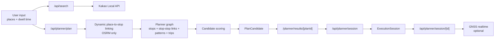

# Jeju Bus Guide Tour Plan

제주 버스 기반 관광 동선 플래너입니다.

사용자가 장소 순서와 체류 시간을 정하면, 현재 적재된 정류장/노선/시간표/도보 링크 데이터를 바탕으로 버스 이동 후보를 계산하고, 실행 세션에서 현재/다음 이동을 확인할 수 있습니다.

이 README는 현재 코드 기준으로 다시 정리한 문서입니다. 이름만 보면 OpenAPI 기반처럼 보이는 job도 있지만, 실제 구현은 아직 `bus.jeju.go.kr` 의존이 큰 부분이 있습니다. 아래 설명은 "의도"가 아니라 "지금 코드가 실제로 하는 일" 기준입니다.

## 현재 상태 요약

- 웹 앱: Next.js 16 + React 19 + Prisma + SQLite
- 기본 개발 포트: `5176`
- 장소 검색: `Kakao Local API`만 사용
- 버스 데이터: 현재 구현 기준으로 대부분 `bus.jeju.go.kr` HTML/JSON endpoint 기반
- 도보 계산: `OSRM` 필수, 직선거리 fallback 없음
- 실행 세션 실시간: `data.go.kr` GNSS + `vehicle-device-map`가 있을 때만 일부 반영
- 관리자 화면: `/admin` (`ENABLE_INTERNAL_ADMIN=true` 필요)

## 지금 제공하는 기능

- 장소 검색
  - `GET /api/search?kind=place`
  - Kakao Local keyword search만 사용
- 정류장 검색
  - `GET /api/search?kind=stop`
  - 내부 `Stop` 테이블에서 검색
  - 단, 활성 `RoutePattern` + `Trip`가 있는 정류장만 노출
- 버스 동선 계산
  - `FASTEST`
  - `LEAST_WALK`
  - `LEAST_TRANSFER`
- 실행 세션 추적
  - 현재 leg / 다음 leg 표시
  - 30초 polling
  - 현재 구현에서는 현재 ride leg일 때만 실시간 지연을 상태 DTO에 직접 반영
- 관리자 화면
  - source catalog
  - ingest jobs / run history
  - POI join 예외
  - route/timetable review
  - vehicle map 통계

## 기술 스택

- Runtime: Node.js 22
- Web: Next.js 16, React 19
- DB: Prisma + SQLite
- Validation: Zod
- Parsing: Cheerio, XLSX, fast-xml-parser
- Testing: Vitest
- Walking graph: OSRM

## 화면 구성

- `/`
  - `/planner`로 redirect
- `/planner`
  - 장소 검색, 방문 순서, 체류 시간 입력
- `/planner/results/[planId]`
  - 후보 3종 확인
- `/planner/execute/[sessionId]`
  - 실행 세션 추적, 현재/다음 leg, 실시간 적용 여부 표시
- `/admin`
  - 내부 운영용 ingest / 검증 화면
  - `ENABLE_INTERNAL_ADMIN=true`일 때만 접근 가능

## 아키텍처 개요



## 데이터 원천과 실제 사용 방식

### 1. 장소 검색

- 현재 플래너의 장소 검색은 `KAKAO_REST_API_KEY` 기반 `Kakao Local API`만 사용합니다.
- `visit-jeju-places` job은 장소 콘텐츠 적재용이며, `/api/search?kind=place`의 fallback으로 사용되지 않습니다.

### 2. 정류장/노선/패턴/시간표

현재 코드상 핵심 transit ingest는 이름과 달리 아직 `bus.jeju.go.kr` 의존이 큽니다.

- `stops`
  - 기본적으로 `bus.jeju.go.kr /data/search/stationListByBounds`
  - 응답을 Station2 유사 구조로 정규화
- `routes-openapi`
  - 실제 구현은 `bus.jeju.go.kr /mobile/schedule/listSchedule` + `detailSchedule`
  - 사용자 노선 마스터(`Route`) 생성
- `route-patterns-openapi`
  - 실제 구현은 `bus.jeju.go.kr /data/search/searchSimpleLineListByLineNumAndType`
  - 그리고 `bus.jeju.go.kr /data/search/getLineInfoByLineId`
  - 이 데이터로 `RoutePattern`, `RoutePatternStop` 생성
- `routes-html`
  - `bus.jeju.go.kr` schedule HTML을 읽어 authoritative pattern에 schedule source 매칭
  - 현재는 `scheduleId + variantKey + routePatternId` 단위
- `timetables-xlsx`
  - schedule table을 읽어 `Trip`, `StopTime` 생성
  - authoritative pattern sequence를 기준으로만 확장

### 3. Jeju BIS OpenAPI

- `JEJU_OPEN_API_BASE_URL`, `JEJU_OPEN_API_SERVICE_KEY` 환경변수와 XML helper는 코드에 있습니다.
- `worker/jobs/jeju-openapi.ts`에서 `StationRoute`, `Bus`, `BusArrives` 등을 직접 읽는 유틸리티도 있습니다.
- 다만 현재 기본 planner ingest 파이프라인은 아직 이 OpenAPI를 핵심 소스로 쓰지 않습니다.
- 즉 "OpenAPI helper는 존재하지만, 실제 기본 ingest는 bus.jeju 기반"이라고 이해하는 것이 정확합니다.

### 4. 도보 경로

- 모든 도보 계산은 `OSRM`을 사용합니다.
- OSRM 연결 실패 시 planner는 오류를 반환합니다.
- 직선거리 fallback은 제거되었습니다.

### 5. 실시간

- GNSS 조회: `data.go.kr`
- device 매핑: `vehicle-device-map` job 결과 필요
- 매핑이나 GNSS 조회가 실패하면 세션 API는 200을 유지하고 시간표 기준 안내로 남습니다.

## 개발 환경 설정

### 필수 준비

1. 의존성 설치

```bash
npm install
```

2. 환경변수 파일 준비

```bash
copy .env.example .env
```

권장 최소 설정:

- `DATABASE_URL`
- `KAKAO_REST_API_KEY`
- `ENABLE_INTERNAL_ADMIN=true` (선택)

planner 품질에 직접 필요한 추가 설정:

- `OSRM_BASE_URL`

실시간까지 쓰려면:

- `DATA_GO_KR_SERVICE_KEY`
- `VEHICLE_MAP_SOURCE_URL`

기타 override:

- `BUS_STOPS_SOURCE_URL`
- `STOP_TRANSLATIONS_XLSX_PATH`
- `ROUTE_TIMETABLE_BASE_URL`
- `VISIT_JEJU_BASE_URL`
- `ROUTE_SEARCH_TERMS`
- `JEJU_OPEN_API_BASE_URL`
- `JEJU_OPEN_API_SERVICE_KEY`

### 주요 환경변수

| 변수 | 현재 코드 기준 의미 |
| --- | --- |
| `DATABASE_URL` | Prisma SQLite 연결 문자열 |
| `KAKAO_REST_API_KEY` | 장소 검색 필수 |
| `OSRM_BASE_URL` | OSRM foot routing base URL. 기본값 `http://localhost:5000` |
| `ENABLE_INTERNAL_ADMIN` | `/admin` 접근 허용 |
| `BUS_JEJU_BASE_URL` | `bus.jeju.go.kr` base URL |
| `DATA_GO_KR_SERVICE_KEY` | GNSS realtime 조회용. `JEJU_OPEN_API_SERVICE_KEY` fallback alias 역할도 겸함 |
| `JEJU_OPEN_API_BASE_URL` | Jeju BIS OpenAPI helper용 base URL |
| `JEJU_OPEN_API_SERVICE_KEY` | Jeju BIS OpenAPI helper용 service key |
| `BUS_STOPS_SOURCE_URL` | 정류장 소스 override |
| `STOP_TRANSLATIONS_XLSX_PATH` | 정류장 번역 overlay 파일 경로 |
| `ROUTE_TIMETABLE_BASE_URL` | 시간표 원본 override |
| `VEHICLE_MAP_SOURCE_URL` | vehicle-device-map job용 매핑 원본 |
| `VISIT_JEJU_BASE_URL` | VISIT JEJU 콘텐츠 ingest 원본 |
| `ROUTE_SEARCH_TERMS` | route discovery 보강용 검색어 목록 |

## 로컬 실행

### 기본 실행

```bash
npm run dev
```

현재 `npm run dev`는 다음을 자동으로 수행합니다.

1. Docker Compose 사용 가능 여부 확인
2. Jeju OSRM dataset 준비
3. OSRM 컨테이너 기동
4. Next.js dev server를 `5176` 포트로 실행

전제:

- Docker Desktop / Docker Compose 필요
- `5000`, `5176` 포트가 비어 있어야 함

### 앱만 따로 실행

```bash
npm run dev:app -- --port 5176
```

이 경우에는 `OSRM_BASE_URL`이 가리키는 OSRM 서버가 이미 떠 있어야 planner가 동작합니다.

### OSRM만 따로 실행/종료

```bash
npm run dev:osrm
npm run dev:osrm:stop
```

### 운영 실행

```bash
npm run build
npm run start
```

운영 기본 포트도 `5176`입니다.

## Worker job 구조

현재 등록된 job 순서는 아래와 같습니다.

1. `stops`
2. `stop-translations`
3. `routes-openapi`
4. `route-patterns-openapi`
5. `routes-html`
6. `timetables-xlsx`
7. `walk-links`
8. `vehicle-device-map`
9. `transit-audit`
10. `visit-jeju-places`

CLI 사용 예시:

```bash
npm run worker -- --job stops
npm run worker -- --job routes-html
npm run worker:run-all
```

### planner를 위한 권장 최소 순서

`/api/search`, `/api/planner/plan`을 실제로 쓰려면 아래 job이 준비되어야 합니다.

1. `stops`
2. `stop-translations` (선택, 없으면 no-op)
3. `routes-openapi`
4. `route-patterns-openapi`
5. `routes-html`
6. `timetables-xlsx`
7. `walk-links`

### 주의: `worker:run-all`

- `worker:run-all`은 등록된 모든 job을 순서대로 실행합니다.
- 따라서 optional job도 같이 실행됩니다.
- 특히 `vehicle-device-map`는 `VEHICLE_MAP_SOURCE_URL`이 없으면 실패합니다.
- 즉 최소 planner readiness만 필요하다면 위 권장 최소 순서를 수동으로 도는 편이 더 안전합니다.

## planner readiness

`GET /api/search`와 `POST /api/planner/plan`은 같은 readiness 체크를 사용합니다.

현재 준비 완료 조건:

- `stops`
- `routes-openapi`
- `route-patterns-openapi`
- `routes-html`
- `timetables-xlsx`
- `walk-links`

위 job들이 모두 한 번 이상 성공했고:

- `stopCount > 0`
- `routePatternCount > 0`
- `tripCount > 0`
- `walkLinkCount > 0`
- `KAKAO_REST_API_KEY` 존재

이면 ready입니다.

중요한 점:

- `visit-jeju-places`는 readiness에 필요하지 않습니다.
- `vehicle-device-map`도 readiness에 필요하지 않습니다.
- readiness 결과는 30초 캐시됩니다.

## 공개 API

### `GET /api/search`

쿼리:

- `kind`: `place | stop`
- `q`: 검색어
- `limit`: `1..20`, 기본 `8`

예시:

```http
GET /api/search?kind=place&q=성산일출봉&limit=8
GET /api/search?kind=stop&q=제주공항&limit=8
```

동작:

- `kind=place`
  - Kakao Local API만 호출
- `kind=stop`
  - 내부 `Stop` 테이블 검색
  - 활성 `RoutePattern`과 `Trip`가 연결된 정류장만 반환

### `POST /api/planner/plan`

입력 조건:

- 장소 수: `2..5`
- 체류 시간: 각 장소당 `10..240분`
- 중복 장소 선택 금지

예시:

```json
{
  "language": "ko",
  "startAt": "2026-03-24T08:00:00.000Z",
  "places": [
    {
      "mode": "external",
      "displayName": "한림공원",
      "latitude": 33.3897,
      "longitude": 126.2399,
      "regionName": "제주",
      "categoryLabel": "관광명소",
      "provider": "kakao",
      "externalId": "11491281",
      "dwellMinutes": 60
    },
    {
      "mode": "external",
      "displayName": "성산일출봉",
      "latitude": 33.4589,
      "longitude": 126.9425,
      "regionName": "제주",
      "categoryLabel": "관광명소",
      "provider": "kakao",
      "externalId": "11491438",
      "dwellMinutes": 60
    }
  ]
}
```

응답:

- `planId`
- 선택 장소 목록
- 후보 최대 3종 (`FASTEST`, `LEAST_WALK`, `LEAST_TRANSFER`)
- 각 후보의 `summary`, `legs`, `warnings`

### `POST /api/planner/session`

입력:

```json
{
  "planCandidateId": "..."
}
```

### `GET /api/planner/session/[id]`

응답:

- 현재 세션 상태
- 현재 leg / 다음 leg
- `realtimeApplied`
- `delayMinutes`
- `nextActionAt`
- `replacementSuggested`

### `POST /api/admin/ingest/run`

내부 관리자 전용입니다.

입력 예시:

```json
{
  "jobKey": "routes-html"
}
```

또는:

```json
{
  "runAll": true
}
```

## 동선 계산 로직

### 입력 검증

- 장소는 `2~5개`
- 체류 시간은 `10~240분`
- stored/external 모두 입력 가능
- 동일 장소 중복 선택은 거부

### 장소 -> 정류장 연결

장소마다 요청 시점에 동적으로 nearby stop을 다시 계산합니다.

현재 규칙:

- 반경 우선: `3km`
- 직선거리 prefilter: 상위 `24`
- OSRM 실측 후 최종 유지: 상위 `12`
- 접근 도보 허용 최대: `25분`
- OSRM 경로가 없으면 해당 link는 버림
- reachable stop이 하나도 없으면 planner는 오류

즉, 현재 place-stop link는 미리 적재된 `PLACE_STOP`에 의존하지 않고 요청 시 재계산합니다.

### planner graph

planner가 실제로 쓰는 그래프는 아래 데이터만 포함합니다.

- `Stop`
- `WalkLink` 중 `STOP_STOP`
- `RoutePattern`
- `Trip`
- `StopTime`
- `VehicleDeviceMap` (실시간 보강용)

중요:

- `RoutePattern`이라도 `Trip`이 없으면 planner graph에 올라오지 않습니다.
- 따라서 패턴은 있어도 시간표가 비어 있으면 실제 경로 계산에서는 사용되지 않습니다.

### 경로 탐색과 후보 생성

현재 엔진은 round-based multi-transfer 탐색입니다.

주요 제약값:

- access stop limit: `12`
- place-stop walk limit: `25분`
- search window: `90~210분`
- segment option limit: `12`
- partial당 확장 option limit: `8`
- frontier limit: `72`
- 최대 ride round: `5`
- 첫 탑승 buffer: `5분`
- 환승 buffer: `4분`
- estimated stop time safety cost: `6분`

후보는 최종적으로 다음 3종을 선택합니다.

- `FASTEST`
- `LEAST_WALK`
- `LEAST_TRANSFER`

점수 함수는 아래 파일을 기준으로 합니다.

- [`src/features/planner/scoring.ts`](/C:/Users/MMM/Desktop/development/grap/guide_tour_plan/src/features/planner/scoring.ts)

현재 공식:

- `FASTEST`
  - `finalArrivalMinutes + transfers*12 + totalWalkMinutes*0.65 + safetyBufferCost + estimatedPenalty`
- `LEAST_WALK`
  - `totalWalkMinutes*10 + transfers*9 + finalArrivalMinutes*0.35 + safetyBufferCost + estimatedPenalty`
- `LEAST_TRANSFER`
  - `transfers*120 + totalWalkMinutes*3 + finalArrivalMinutes*0.5 + safetyBufferCost + estimatedPenalty`

### 경고 생성

후보별로 아래 경고가 붙을 수 있습니다.

- `OPENING_HOURS_CONFLICT`
- `ESTIMATED_STOP_TIMES`
- `REALTIME_UNAVAILABLE`
- `TRANSFER_REQUIRED`

`REALTIME_UNAVAILABLE`의 현재 의미는 "후보 전체에 실시간 적용 가능한 패턴이 없음"에 더 가깝습니다.

## 실행 세션과 실시간

- `/planner/execute/[sessionId]`는 30초마다 세션 API를 polling합니다.
- 현재/다음 ride leg를 기준으로 실시간 조회 대상을 고릅니다.
- 다만 최종 상태 DTO에 `realtimeApplied`, `delayMinutes`가 직접 반영되는 것은 현재 leg가 `ride`일 때뿐입니다.

실시간 동작 전제:

- `DATA_GO_KR_SERVICE_KEY`
- `vehicle-device-map` 결과
- 대상 `routePatternId`에 대응되는 device mapping

실패 시 동작:

- 세션 API는 200을 유지
- notice는 시간표 기준 안내로 남음

## 관리자 화면

`/admin`에서는 현재 아래 정보를 볼 수 있습니다.

- Source Catalog
- Ingest Jobs / Runs
- POI Join Exceptions
- Route Pattern Review
- Timetable / Vehicle Map

`ENABLE_INTERNAL_ADMIN=true`가 아니면 노출되지 않습니다.

## 현재 코드 기준 한계와 주의사항

### 1. 장소 검색은 Kakao-only

- 현재 `/api/search?kind=place`는 Kakao만 사용합니다.
- VISIT JEJU 데이터는 place search fallback이 아닙니다.

### 2. OSRM 필수

- planner와 `walk-links`는 OSRM 없이는 동작하지 않습니다.
- 더 이상 직선거리 fallback이 없습니다.

### 3. job 이름과 실제 소스가 완전히 일치하지 않음

- `routes-openapi`, `route-patterns-openapi`라는 이름이지만
- 현재 기본 구현은 여전히 `bus.jeju.go.kr` live/search endpoint 의존이 큽니다.

### 4. 시간표 누락이 있으면 좋은 경로를 놓칠 수 있음

- 현재 planner는 `Trip`이 있는 pattern만 사용합니다.
- 따라서 실제 현장에는 버스가 오더라도, 해당 패턴의 schedule source / trip가 비어 있으면 경로 후보에 나타나지 않습니다.
- 실제 확인된 사례로 일부 `202` 계열은 pattern은 존재하지만 trip가 없어 cleaner route를 놓칠 수 있습니다.

### 5. stop-to-stop 도보 연쇄가 길어질 수 있음

- 현재 엔진은 `STOP_STOP` walk link를 연속해서 탈 수 있습니다.
- 데이터가 비는 구간에서는 사람이 보기엔 부자연스러운 "정류장 연속 도보 환승" 경로가 나올 수 있습니다.

### 6. `worker:run-all`은 optional job까지 포함

- `vehicle-device-map` 환경변수가 없으면 `worker:run-all`이 중간에 실패할 수 있습니다.
- planner만 준비하려면 권장 최소 순서를 수동으로 실행하는 편이 더 안전합니다.

## 테스트와 검증

```bash
npm run typecheck
npm test
npm run build
```

Windows에서는 Prisma DLL rename 관련 `EPERM`이 간헐적으로 발생할 수 있습니다. 이 경우 Prisma/Node 프로세스를 정리한 뒤 다시 빌드하는 편이 안전합니다.

## 프로젝트 구조

```text
app/                      Next.js App Router pages and API routes
src/components/           UI components
src/features/admin/       Admin dashboard query logic
src/features/planner/     Search, planning, scoring, warnings, realtime
src/lib/                  Env, db, source catalog, OSRM helpers, errors
prisma/                   Prisma schema and seed
tests/                    Vitest tests
worker/core/              Worker runtime, fetch helpers, job runner
worker/jobs/              Ingest jobs and parsers
scripts/                  dev / OSRM helper scripts
docker/osrm/              OSRM dataset and compose assets
```
