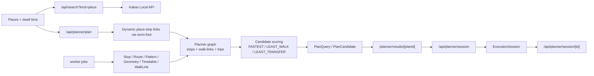

# Jeju Bus Guide Tour Plan

제주 버스 기반 관광 동선 추천 및 실행 추적용 Next.js 애플리케이션입니다.

사용자가 2~5개의 장소와 각 장소 체류 시간을 넣으면, 현재 적재된 정류장, 노선 패턴, 시간표, 도보 링크를 바탕으로 다음 3개 후보를 계산합니다.

- `FASTEST`
- `LEAST_WALK`
- `LEAST_TRANSFER`

결과 후보는 `/planner/results/[planId]`에서 비교하고, 선택한 후보는 `/planner/execute/[sessionId]`에서 실행 세션으로 확인할 수 있습니다.

이 README는 `2026-03-26` 현재 코드와 로컬 `dev.db` 상태를 기준으로 정리했습니다. 운영 데이터는 ingest 재실행에 따라 달라질 수 있으므로, 숫자는 스냅샷으로 보시면 됩니다.

## 현재 상태 요약

- 활성 일반 노선 기준 `Route` `198개`, `RoutePattern` `863개`, 활성 `RoutePatternScheduleSource` `642개`, `Trip` `8,995개`
- 활성 source인데 `Trip`이 하나도 없는 경우는 현재 `0개`
- 활성 네트워크에서 공식 시각이 있는 정류장 `687개`, 생성 시각까지 포함하면 `1,695개`, 둘 중 하나라도 있으면 `2,080개`
- 활성 네트워크 정류장 중 공식/생성 시각이 모두 없는 정류장은 현재 `779개`
- 최신 `routes-html` 성공 run은 `2026-03-26 11:46~12:00 KST`
  - `matched variant 628`
  - `unmatched variant 59`
  - `skipped variant 83`
- 최신 `timetables-xlsx` 성공 run은 `2026-03-26 13:11~13:38 KST`
  - `schedule source 642`
  - `trip 8,995`
  - `derived stop time 146,875`
- mixed variant table 보정이 현재 코드에 반영되어 있고, 최신 run에서는 `43-1/43-2/43-3` 계열 `6개 schedule`이 `resolvedMixedVariantSchedules`로 기록됐으며 `unresolvedMixedVariantSchedules`는 `0개`

## 프로젝트가 하는 일

1. 기본 UI는 Kakao 장소 검색으로 외부 장소를 받습니다.
2. 각 장소를 OSRM 도보 경로로 주변 정류장과 동적으로 연결합니다.
3. 활성 노선 패턴, 활성 시간표 source, `Trip`, `StopTime`, 선택적 `DerivedStopTime`, 정류장 간 도보 링크를 합쳐 planner graph를 만듭니다.
4. round-based 탐색으로 3개의 후보 동선을 계산합니다.
5. 실행 세션은 선택한 후보 snapshot을 기준으로 현재 구간과 다음 구간을 계산합니다.

## 최근 코드 변경 포인트

- `routes-html`는 이제 mixed variant table에서 빈 variant row를 직전 명시 variant로 상속합니다.
- `routes-html` 메타에 `reasonSubtype`, `rejectionBreakdown`, `resolvedMixedVariantSchedules`, `unresolvedMixedVariantSchedules`, `inheritedVariantRowCount`, `unresolvedVariantRowCount`가 들어갑니다.
- `routes-html`를 단독 실행하면 `timetables-xlsx`가 자동 후속 실행됩니다.
- planner, stop search, admin 카운트는 모두 `active route` 기준으로만 계산합니다.
- 정류장명 alias가 보강되어 `제주대/제주대학교`, `한라대/제주한라대학교`, `로타리/로터리`, 터미널 공백 차이, `용담사거리` 표기 차이 등을 100점 동치로 처리합니다.

## 기술 스택

- Runtime: Node.js 22
- Web: Next.js 16, React 19, App Router
- Database: Prisma + SQLite
- Validation: Zod
- Parsing: Cheerio, XLSX, fast-xml-parser, csv-parse
- Routing: OSRM
- Test: Vitest

## 핵심 데이터 모델

- `Place`
  - VISIT JEJU에서 적재한 저장형 POI
- `Stop`
  - 제주 BIS 정류장
- `Route`
  - 노선 master
- `RoutePattern`
  - stop-level 운행 패턴
- `RoutePatternScheduleSource`
  - HTML 시간표 source와 pattern의 authoritative 연결
- `Trip`
  - 시간표 row를 실제 운행 row로 펼친 결과
- `StopTime`
  - 공식 시각만 저장
- `DerivedStopTime`
  - 공식 anchor 사이에서 안전하게 생성한 보조 시각
- `WalkLink`
  - 장소-정류장, 정류장-정류장 도보 링크
- `ExecutionSession`
  - 실행 중인 후보 snapshot
- `IngestJob` / `IngestRun`
  - worker job catalog와 최근 실행 기록

## 아키텍처 개요



## Planner 동작 방식

### 1. 장소 입력

- 기본 `/planner` UI는 `GET /api/search?kind=place`를 통해 Kakao 장소 검색만 사용합니다.
- planner API는 두 종류의 장소 입력을 받습니다.
  - `stored`: DB에 저장된 `Place`
  - `external`: 위도/경도 기반 외부 장소
- 현재 기본 UI는 저장형 VISIT JEJU POI 검색을 직접 노출하지 않습니다.

### 2. place -> stop 연결

- place-stop 링크는 요청 시점마다 `osrm-foot`로 다시 계산합니다.
- 현재 상수:
  - crow-distance prefilter: 상위 `24개` 정류장
  - 최종 사용: 상위 `12개` 정류장
  - 장소 주변 반경: `3km`
  - 장소-정류장 최대 도보: `25분`
- 즉 planner는 `PLACE_STOP` 링크를 고정 테이블에서 읽지 않고 on-demand 측정 결과를 사용합니다.

### 3. planner graph에 들어가는 것

planner는 현재 다음 데이터만 사용합니다.

- `Stop`
- `WalkLink(kind=STOP_STOP)`
- `RoutePattern`
- `Trip`
- `StopTime`
- `DerivedStopTime` (`includeGeneratedTimes=true`일 때만)

그리고 다음 조건을 모두 만족해야 실제 탐색 대상이 됩니다.

- `Route.isActive=true`
- `RoutePattern.isActive=true`
- `RoutePatternScheduleSource.isActive=true`
- 해당 source로 만들어진 `Trip` 존재
- 해당 trip에 최소 2개의 공식 anchor stop time 존재

### 4. 공식 시각과 생성 시각

- `StopTime`
  - 공식 시각만 저장
  - `isEstimated=false`, `timeSource=OFFICIAL`
- `DerivedStopTime`
  - 공식 anchor 두 점 사이의 중간 정류장만 보조 생성
  - 현재 주 사용 source는 `OFFICIAL_ANCHOR_INTERPOLATED`

`includeGeneratedTimes=true`를 켜면 planner는 공식 시각에 `DerivedStopTime`를 합쳐서 사용합니다. 하지만 생성 시각은 공격적으로 채우지 않습니다. 아래 조건을 벗어나면 비워 둡니다.

- 공식 anchor 사이 interior stop gap `<= 8`
- anchor span distance `<= 12km`
- anchor span time `<= 45분`
- stop projection confidence `>= 0.55`
- stop projection snap distance `<= 250m`

즉 `includeGeneratedTimes`는 "trip이 없던 노선을 새로 만드는 옵션"이 아니라, 이미 붙은 trip 안에서 중간 정류장 시각만 보강하는 옵션입니다.

### 5. 후보 생성

현재 탐색 상수는 다음과 같습니다.

- access stop limit: `12`
- place-stop walk limit: `25분`
- segment search window: `90~210분`
- partial frontier limit: `72`
- max ride rounds: `5`
- first board buffer: `5분`
- transfer buffer: `4분`
- estimated stop time safety cost: `6분`

결과 후보는 항상 아래 3개 preference 이름으로 정리됩니다.

- `FASTEST`
- `LEAST_WALK`
- `LEAST_TRANSFER`

### 6. 경고

현재 planner가 생성하는 경고는 다음 4종류입니다.

- `OPENING_HOURS_CONFLICT`
- `ESTIMATED_STOP_TIMES`
- `REALTIME_UNAVAILABLE`
- `TRANSFER_REQUIRED`

주의할 점:

- `OPENING_HOURS_CONFLICT`는 opening-hours JSON이 있는 저장형 `Place`에만 의미가 있습니다.
- 기본 `/planner` UI는 Kakao external place 중심이라 운영시간 경고는 자주 나오지 않습니다.

### 7. 실행 세션과 realtime

- `POST /api/planner/session`은 선택한 후보 snapshot을 `ExecutionSession`으로 저장합니다.
- `/planner/execute/[sessionId]`는 현재/다음 leg를 polling으로 확인합니다.
- GNSS 수집, vehicle-device-map, delay 추정 helper 코드는 존재합니다.
- 하지만 현재 `getExecutionSessionStatus()`는 realtime 소스를 실제로 적용하지 않고, snapshot/timetable 기반 상태만 반환합니다.

즉 스키마와 보조 코드는 realtime-ready에 가깝지만, 실제 API 응답 경로는 아직 fully wired 상태가 아닙니다.

## 특수 노선 제외 정책

현재 코드에서는 다음 키워드가 route label에 포함되면 일반 planner 네트워크에서 제외 대상으로 봅니다.

- `임시`
- `우도`
- `옵서버스`
- `관광지순환`
- `마을버스`

이 정책은 세 군데에 걸쳐 반영됩니다.

- `routes-openapi`
  - 제외 대상 route를 `Route.isActive=false`로 적재
- `routes-html`
  - 제외 대상 schedule을 `SPECIAL_ROUTE_EXCLUDED`로 skip
- planner / stop search / admin stats
  - `active route`만 사용

정책을 바꾸면 최소한 아래 job은 다시 돌려야 합니다.

1. `routes-openapi`
2. `route-patterns-openapi`
3. `routes-html`
4. `timetables-xlsx`

## Ingest 파이프라인

### 실제 worker job 목록

| Job key | 실제 upstream | 주 write 대상 | 비고 |
| --- | --- | --- | --- |
| `stops` | `bus.jeju.go.kr/data/search/stationListByBounds` 또는 override source | `Stop`, `StopTranslation` | planner readiness 필수 |
| `stop-translations` | local `.xlsx` / `.json` overlay | `StopTranslation` | optional |
| `routes-openapi` | `bus.jeju.go.kr/mobile/schedule/listSchedule` + detail HTML | `Route` | 이름은 historical naming이고 실제 구현은 HTML 기반 |
| `route-patterns-openapi` | `bus.jeju.go.kr/data/search/searchSimpleLineListByLineNumAndType`, `getLineInfoByLineId` | `RoutePattern`, `RoutePatternStop` | active route만 대상 |
| `routes-html` | `bus.jeju.go.kr` schedule HTML table | `RoutePatternScheduleSource` | authoritative pattern matching, near miss 진단 포함 |
| `route-geometries` | Bus Jeju link geometry -> GTFS -> OSRM fallback | `RoutePatternGeometry`, `RoutePatternStopProjection` | 실제 write source는 `BUS_JEJU_LINK`, `GTFS`, `OSRM_DERIVED` |
| `timetables-xlsx` | parsed schedule table | `Trip`, `StopTime`, `DerivedStopTime` | sparse official + conservative derived times |
| `walk-links` | `osrm-foot` | `WalkLink` | stop-stop graph 및 POI 주변 링크 |
| `vehicle-device-map` | override source 또는 `getRealTimeBusPositionByLineId` | `VehicleDeviceMap` | planner realtime 보조 데이터 |
| `gnss-history` | data.go.kr GNSS API | `GnssObservation` | run-all 기본 포함 아님 |
| `transit-audit` | live line info + local DB | audit meta only | coverage/geometry 진단 |
| `visit-jeju-places` | VISIT JEJU live crawl 또는 override source | `Place` 계열 | stored POI ingest |

### `worker:run-all` 실제 순서

현재 코드에서 `npm run worker:run-all`은 아래 순서로만 실행합니다.

1. `stops`
2. `stop-translations`
3. `routes-openapi`
4. `route-patterns-openapi`
5. `routes-html`
6. `route-geometries`
7. `timetables-xlsx`
8. `walk-links`
9. `vehicle-device-map`
10. `transit-audit`
11. `visit-jeju-places`

주의:

- `gnss-history`는 active job이지만 `worker:run-all`에 포함되지 않습니다.
- `segment-profiles`, `osrm-bus-customize`는 catalog에는 있으나 기본 inactive입니다.

### 단일 job 실행의 후속 동작

- `routes-html`를 단독 실행하면 `timetables-xlsx`가 자동 follow-up으로 이어집니다.
- 목적은 `active schedule source는 갱신됐는데 trip이 비어 있는 상태`를 줄이는 것입니다.
- `worker:run-all`에서는 이미 명시 순서에 `timetables-xlsx`가 있으므로 중복 follow-up을 만들지 않습니다.

### 비활성화된 job

다음 job은 코드와 registry에는 있지만 기본 source catalog에서 `isActive=false`입니다.

- `segment-profiles`
- `osrm-bus-customize`

현재 planner readiness에도 포함되지 않고, `runJobByKey()`에서도 비활성 상태면 막힙니다.

## Schedule Matching 진단

`routes-html`은 단순 `scheduleId -> routePatternId` 1:1 연결이 아닙니다. schedule table의 stop profile을 pattern stop sequence와 authoritative하게 맞춘 뒤에만 source를 붙입니다.

현재 진단 포인트는 다음과 같습니다.

- `matchedVariants`
- `unmatchedVariants`
- `skippedSpecialSchedules`
- `nearMisses`
- `rejectionBreakdown`
- `resolvedMixedVariantSchedules`
- `unresolvedMixedVariantSchedules`
- `inheritedVariantRowCount`
- `unresolvedVariantRowCount`

최신 `routes-html` run 기준 rejection breakdown은 다음과 같습니다.

- `low_coverage`: `25`
- `authoritativeness_gap`: `14`
- `sparse_profile`: `13`
- `no_candidates`: `3`
- `processing_error(fetch failed)`: `2`
- `processing_error(timeout)`: `2`

즉 지금 남아 있는 실패는 parser crash보다도 `authoritative matching`에서 걸리는 케이스가 중심입니다.

## Planner readiness

`GET /api/search`와 `POST /api/planner/plan`은 같은 readiness 체크를 사용합니다.

필수 successful job:

- `stops`
- `routes-openapi`
- `route-patterns-openapi`
- `routes-html`
- `route-geometries`
- `timetables-xlsx`
- `walk-links`

추가 조건:

- `stopCount > 0`
- `routePatternCount > 0`
- `tripCount > 0`
- `timetableRoutePatternCount > 0`
- `walkLinkCount > 0`
- `KAKAO_REST_API_KEY` 존재

보조 job인 아래 항목은 readiness 필수가 아닙니다.

- `visit-jeju-places`
- `vehicle-device-map`
- `gnss-history`
- `transit-audit`
- `segment-profiles`
- `osrm-bus-customize`

readiness 결과는 30초 캐시됩니다.

## Admin 화면

`/admin`은 `ENABLE_INTERNAL_ADMIN=true`일 때만 열립니다.

현재 admin에서 볼 수 있는 핵심 진단은 다음과 같습니다.

- Source Catalog / active job 목록
- 최근 ingest run
- Schedule Matching
  - active schedule source 수
  - matched / unmatched / skipped variant 수
  - top matched / unmatched family
  - near misses
  - rejection breakdown
  - mixed variant diagnostics
- Timetable materialization
  - latest `routes-html`
  - latest `timetables-xlsx`
  - `in_sync / refreshing / stale`
  - active source without trips
- Route Pattern Review
- Geometry / projection coverage
- Vehicle map coverage

## 현재 문제점 정리

### 1. 시간표 페이지는 있는데 pattern에 붙이지 못하는 일반 노선이 남아 있습니다

대표 예시는 `771-2`입니다.

- 공개 시간표 페이지: [771-2 schedule page](https://bus.jeju.go.kr/schedule/view/771-2)
- HTML 시간표는 `동광, 오설록, 명리동, 청수리, 산양리, 산수동, 고산2리, 고산1리, 차귀도포구, 고산`처럼 큰 timing point `10개`만 보여줍니다.
- 하지만 현재 로컬 pattern은 `22개`, `25개`, `35개` stop-level pattern `3개`로 나뉘어 있습니다.
- 최신 `routes-html` run에서 best candidate도 `10개 중 7개`만 맞아 coverage `0.70`에 그쳤습니다.
- 현재 authoritative minimum coverage는 `0.75`이므로 source를 붙이지 않습니다.

즉 `771-2`는 "시간표가 없음"이 아니라 "시간표 페이지와 우리 stop-level pattern이 충분히 authoritative하게 맞지 않음"이 문제입니다.

현재 활성 네트워크에서 이런 `no source only` 성격의 미해결 정류장은 `321개`입니다. 많이 걸리는 family는 다음과 같습니다.

- `295`: `24`
- `771-2`: `22`
- `수요맞춤형 295-1`: `21`
- `743`: `17`
- `201`: `15`
- `810-1`: `15`
- `810-2`: `15`
- `703-2`: `14`

### 2. trip은 있는데 작은 정류장까지 시각을 안전하게 내리지 못하는 경우가 남아 있습니다

이 부류는 현재 `458개` 정류장입니다.

- `47개`
  - 해당 stop이 속한 활성 pattern들 모두 trip은 있으나, 그 stop 자체에는 공식/생성 시각이 끝까지 안 내려오는 순수 branch gap
- `411개`
  - 같은 stop 주변에 time-covered pattern과 uncovered sibling pattern이 섞여 있는 mixed branch gap

많이 걸리는 family는 다음과 같습니다.

- `201`: `104`
- `202`: `60`
- `231번, 232`: `41`
- `211번/212`: `39`
- `251번/251-1번252번/253번/254`: `38`
- `221번/222`: `27`

이 문제는 대체로 본선 시간표는 있는데, 분기/단축/세부 stop까지는 표가 충분히 쪼개져 있지 않은 경우입니다.

### 3. sparse official anchor는 있어도 derived time 생성 guardrail 때문에 중간 정류장이 비는 경우가 있습니다

`431` pattern `pattern-openapi-405243101-1-0`는 현재 이 문제를 설명하기 좋은 예시입니다.

- pattern stop 수: `38`
- active schedule source: `scheduleId 1301`
- sample trip 공식 시각 sequence: `1, 8, 27, 32, 42, 49, 61, 68`
- 대표적으로 비는 stop:
  - `삼담우체국`
  - `미래컨벤션센터`
  - `용담새마을금고[동]`
  - `용화로[북]`
  - `용마로`
- 이 pattern은 stop projection의 `offsetMeters`가 여러 정류장에서 같은 값으로 뭉쳐 있어, 안전한 anchor span 보간이 성립하지 않는 구간이 있습니다.
- 현재 코드는 이런 경우 억지로 시간을 채우지 않고 `DerivedStopTime` 생성을 포기합니다.

즉 "버스는 지나가지만 표에 대표 시점만 있고, geometry/projection까지 애매해서 작은 정류장 시간은 일부러 비워 두는 상태"가 존재합니다.

### 4. special route는 일반 planner 네트워크에서 빼는 방향으로 정리 중입니다

현재 코드 정책상 `임시`, `우도`, `옵서버스`, `관광지순환`, `마을버스` 계열은 일반 planner 대상에서 제외합니다.

이 부류는 현재 일반 네트워크 coverage 계산에서 분리해서 보는 것이 맞습니다. 즉 현재 `779개` unresolved stop 분석은 "특수 노선을 제외하고도 아직 남아 있는 일반 네트워크 문제"를 보려는 목적에 가깝습니다.

### 5. realtime 스키마는 있지만 실행 세션 응답 경로는 아직 timetable snapshot 중심입니다

- `vehicle-device-map`
- `gnss-history`
- GNSS 기반 지연 추정 helper

위 구성요소는 존재하지만, `GET /api/planner/session/[id]`는 아직 realtime signal을 실제로 적용하지 않습니다. 현재는 실행 session UX와 admin 진단이 먼저 구현된 상태입니다.

## 환경 변수

기본 예시는 [`.env.example`](./.env.example)에 있습니다.

| 변수 | 설명 |
| --- | --- |
| `DATABASE_URL` | Prisma SQLite 연결 문자열 |
| `DATA_GO_KR_SERVICE_KEY` | GNSS raw history 수집 key |
| `JEJU_OPEN_API_BASE_URL` | 제주 OpenAPI base URL |
| `JEJU_OPEN_API_SERVICE_KEY` | 제주 OpenAPI service key |
| `OSRM_BASE_URL` | `OSRM_FOOT_BASE_URL` alias |
| `OSRM_FOOT_BASE_URL` | 도보 OSRM base URL |
| `OSRM_BUS_DISTANCE_BASE_URL` | 버스 geometry / distance OSRM |
| `OSRM_BUS_ETA_BASE_URL` | 버스 ETA OSRM |
| `OSRM_BUS_ETA_DATASET_NAME` | shared-memory ETA dataset 이름 |
| `GTFS_FEED_URL` | GTFS zip URL |
| `GTFS_SHAPES_PATH` | local GTFS zip 또는 폴더 경로 |
| `BUS_OSRM_VEHICLE_HEIGHT` | bus OSRM profile 높이 |
| `BUS_OSRM_VEHICLE_WIDTH` | bus OSRM profile 폭 |
| `BUS_OSRM_VEHICLE_LENGTH` | bus OSRM profile 길이 |
| `BUS_OSRM_VEHICLE_WEIGHT` | bus OSRM profile 중량 |
| `ENABLE_INTERNAL_ADMIN` | `/admin` 활성화 |
| `BUS_JEJU_BASE_URL` | 기본 `https://bus.jeju.go.kr` |
| `KAKAO_REST_API_KEY` | 기본 place search 필수 |
| `VISIT_JEJU_BASE_URL` | VISIT JEJU override source |
| `BUS_STOPS_SOURCE_URL` | stop source override |
| `STOP_TRANSLATIONS_XLSX_PATH` | stop translation overlay 경로 |
| `ROUTE_TIMETABLE_BASE_URL` | timetable source override |
| `VEHICLE_MAP_SOURCE_URL` | curated vehicle mapping source override |
| `ROUTE_SEARCH_TERMS` | 추가 route discovery 검색어 목록(쉼표 구분) |

## 로컬 실행

### 1. 설치

```bash
npm install
copy .env.example .env
```

SQLite 스키마와 source catalog를 맞추려면:

```bash
npm run prisma:push
npm run prisma:seed
```

`prisma:seed`는 sample transit data를 넣지 않고, source catalog만 동기화합니다.

### 2. 기본 개발 실행

```bash
npm run dev
```

이 스크립트는 가능하면 OSRM을 먼저 준비하고, Next.js dev server를 기본 `5176` 포트로 띄웁니다.

### 3. 앱만 실행

```bash
npm run dev:app -- --port 5176
```

이 경우 OSRM은 이미 떠 있어야 합니다.

### 4. OSRM만 실행 / 종료

```bash
npm run dev:osrm
npm run dev:osrm:stop
```

### 5. GTFS source 점검

```bash
npm run gtfs:probe
npm run gtfs:probe -- C:\path\to\gtfs.zip
```

### 6. build / start

```bash
npm run build
npm run start
```

운영 서버는 기본적으로 `5176` 포트를 사용합니다.

## Docker Compose

`docker-compose.yml`에는 다음 서비스가 정의되어 있습니다.

- `web`
- `worker`
- `osrm-foot`
- `osrm-bus-distance`
- `osrm-bus-eta`

주의:

- `worker` 서비스는 장기 cron worker가 아니라 `npm run worker:run-all`을 한 번 실행하는 one-shot 성격입니다.
- `gnss-history` 같은 반복 수집은 별도 scheduler가 필요합니다.

## Worker 실행 예시

```bash
npm run worker -- --job stops
npm run worker -- --job routes-html
npm run worker -- --job route-geometries
npm run worker -- --job gnss-history
npm run worker:run-all
```

planner를 실제로 켜기 위한 최소 권장 순서는 아래와 같습니다.

1. `stops`
2. `stop-translations` 선택
3. `routes-openapi`
4. `route-patterns-openapi`
5. `routes-html`
6. `route-geometries`
7. `timetables-xlsx`
8. `walk-links`

realtime 보조 데이터를 추가하려면:

1. `vehicle-device-map`
2. `gnss-history` 반복 실행

## API 요약

### `GET /api/search`

query params:

- `kind`: `place | stop`
- `q`
- `limit`: `1..20`, 기본 `8`
- `includeGeneratedStops`: `boolean`, stop search에서만 의미 있음

현재 구현:

- `kind=place`
  - Kakao place search 결과 반환
- `kind=stop`
  - local DB `Stop` 검색
  - `includeGeneratedStops=true`면 generated-only stop도 허용
  - `meta.coverage`
    - `official`
    - `mixed`
    - `generated_only`

### `POST /api/planner/plan`

입력 제약:

- 장소 수 `2..5`
- 체류 시간 `10..240분`
- 중복 장소 금지
- `includeGeneratedTimes` optional
- `preference` optional

응답:

- `planId`
- `places`
- `candidates`
- `fallbackMessage`
- `includeGeneratedTimes`

### `POST /api/planner/session`

입력:

```json
{
  "planCandidateId": "..."
}
```

응답:

```json
{
  "sessionId": "...",
  "executeUrl": "/planner/execute/..."
}
```

### `GET /api/planner/session/[id]`

주요 필드:

- `status`
- `currentLeg`
- `nextLeg`
- `nextActionAt`
- `realtimeApplied`
- `delayMinutes`
- `replacementSuggested`
- `notice`

현재 코드 기준:

- 필드 구조는 realtime 확장을 염두에 두고 있음
- 실제 응답은 timetable snapshot 기반 상태 계산이 중심

### `POST /api/admin/ingest/run`

관리자 전용 API입니다.

예시:

```json
{
  "jobKey": "routes-html"
}
```

또는:

```json
{
  "runAll": true
}
```

`routes-html`를 단독 실행하면 응답 안의 `results`에 후속 `timetables-xlsx` 결과도 함께 들어옵니다.

## 검증 명령

```bash
npm run typecheck
npm test
npm run build
```

문서만 수정할 때는 보통 `typecheck`나 `test`가 필요 없지만, 실제 코드 변경 전후 확인에는 위 세 가지를 권장합니다.

## 프로젝트 구조

```text
app/                      Next.js App Router pages and API routes
src/components/           UI components
src/features/admin/       Admin dashboard queries
src/features/planner/     Search, planning, scoring, session logic
src/lib/                  Env, db, GTFS, OSRM, geometry, source catalog
prisma/                   Prisma schema and seed
tests/                    Vitest tests
worker/core/              Worker runtime and job runner
worker/jobs/              Ingest jobs and parsing helpers
scripts/                  dev / OSRM / GTFS probe scripts
docker/osrm/              OSRM datasets and profiles
```

## 참고

- helper module인 `route-labels`, `schedule-pattern-matching`, `schedule-authoritativeness`는 standalone job이 아니라 `routes-html`, `timetables-xlsx`, `route-geometries`가 공유하는 매칭 로직입니다.
- planner service time은 `Asia/Seoul` 기준으로 계산합니다.
- 현재 기본 place search는 Kakao 외부 검색 중심이고, VISIT JEJU POI는 planner content ingest용으로 유지되고 있습니다.
